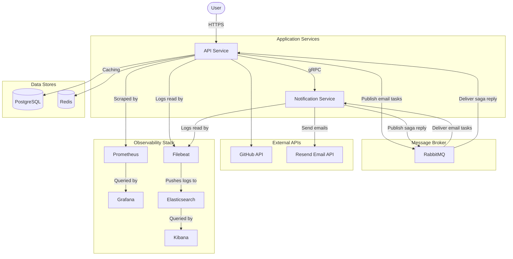
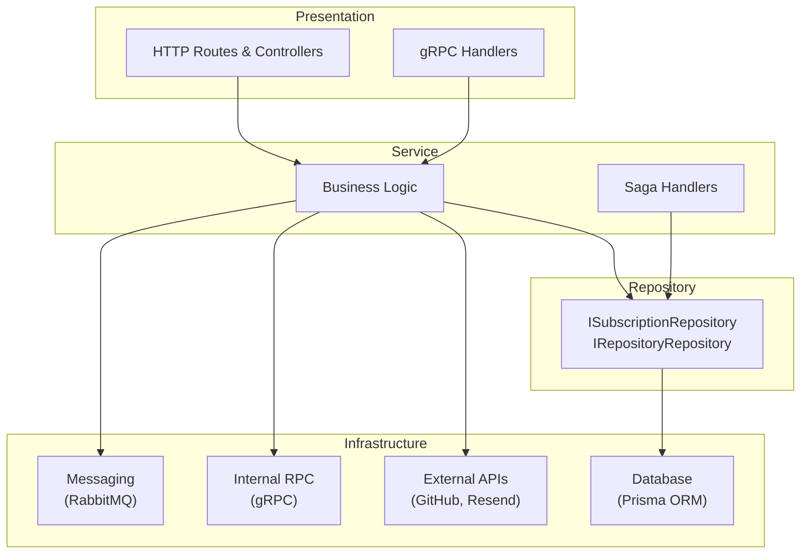
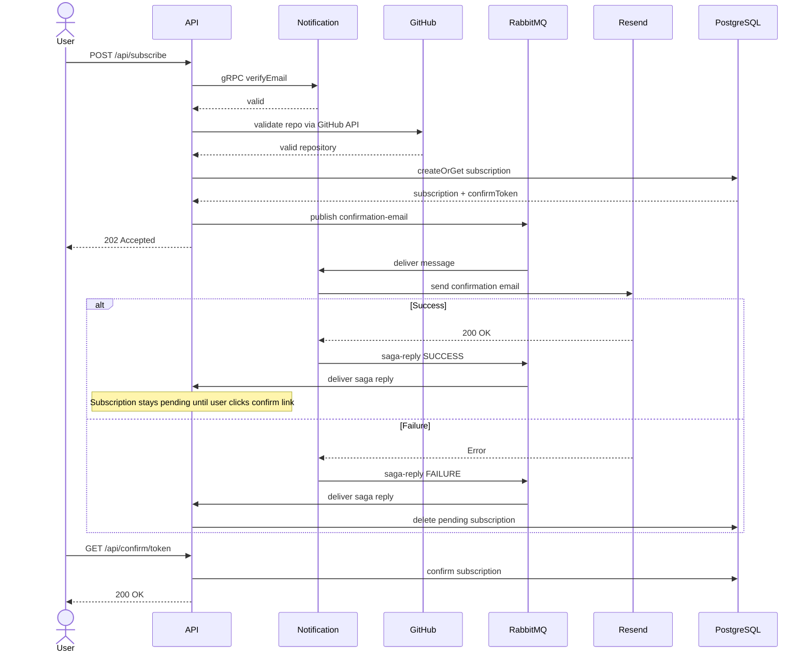
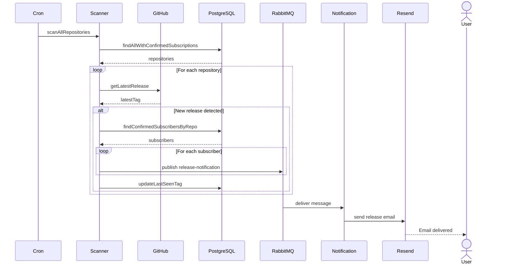

# Architecture: GitHub Release Notification API

## 1. High-Level Overview

The system allows users to subscribe to email notifications about new releases of a chosen GitHub repository. It is built as a monorepo with two microservices that communicate asynchronously via **RabbitMQ** and synchronously via **gRPC**. 

- **API Service** — handles user-facing HTTP requests, manages subscriptions, and runs a cron-based scanner that detects new GitHub releases
- **Notification Service** — sends emails (confirmation and release notifications), verifies email addresses, and reports delivery results back via a saga pattern
- **Shared Package** — contains DTOs (Zod schemas), RabbitMQ connection logic, retry utilities, protobuf-generated gRPC stubs, and shared types used by both services

---

## 2. Layered Architecture

Both services follow a **layered architecture** with dependency inversion — business logic depends on interfaces, not concrete implementations. 

---

## 3. Key Flows

### 3.1 Subscription Flow 

### 3.2 Release Scan & Notification Flow

