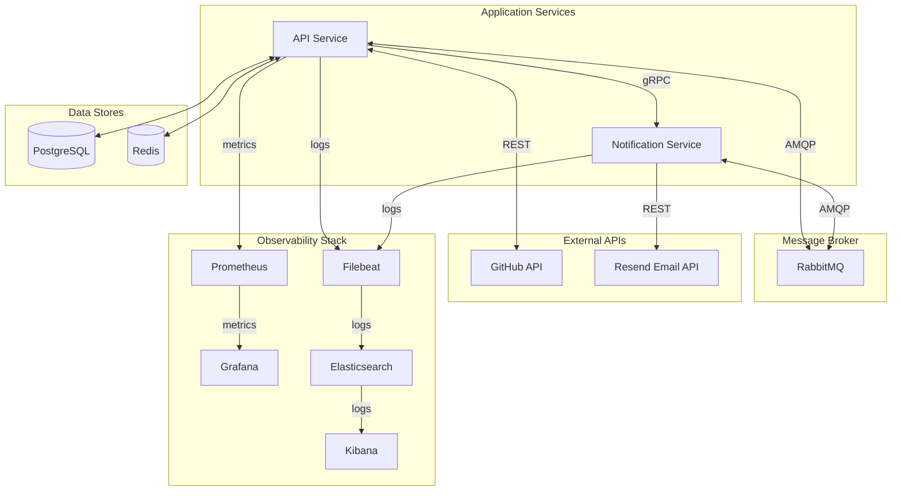
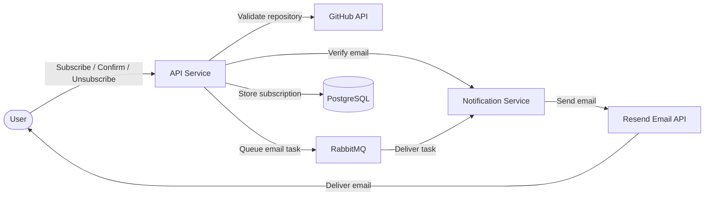
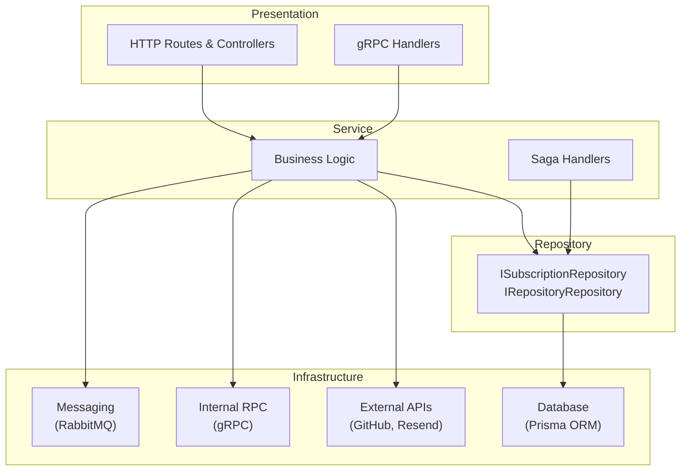

# Architecture: GitHub Release Notification API

## 1. High-Level Overview

The system allows users to subscribe to email notifications about new releases of a chosen GitHub repository. It is built as a monorepo with two microservices that communicate asynchronously via **RabbitMQ** and synchronously via **gRPC**.

### API Service

- HTTP API: subscribe, confirm, unsubscribe, list subscriptions
- Email verification via gRPC call to Notification Service
- Repository validation via GitHub API
- Cron-based release scanner — polls GitHub for new tags
- Publishes email tasks to RabbitMQ (confirmation + release notification)
- Handles saga replies — compensates on email delivery failure (deletes pending subscription)

### Notification Service

- gRPC server for email verification
- Consumes RabbitMQ queues: `confirmation-email`, `release-notification`
- Sends emails via Resend API
- Publishes saga replies back to RabbitMQ
- Retry on delivery failures

### Shared Package

- DTOs with Zod schemas for queue message validation
- RabbitMQ connection and queue configuration
- Protobuf-generated gRPC stubs
- Retry utilities and shared types

### Infrastructure

### User Flow

---

## 2. Layered Architecture

Both services follow a **layered architecture** with dependency inversion — business logic depends on interfaces, not concrete implementations.

