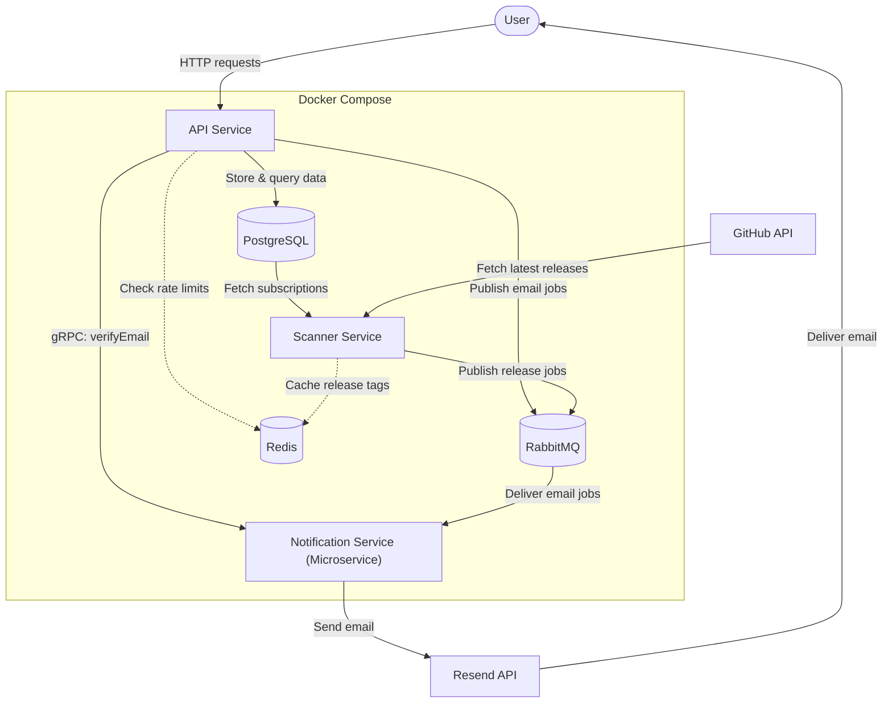
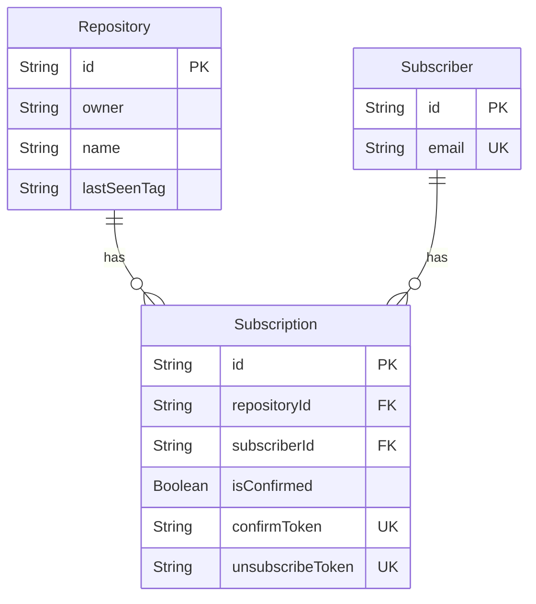
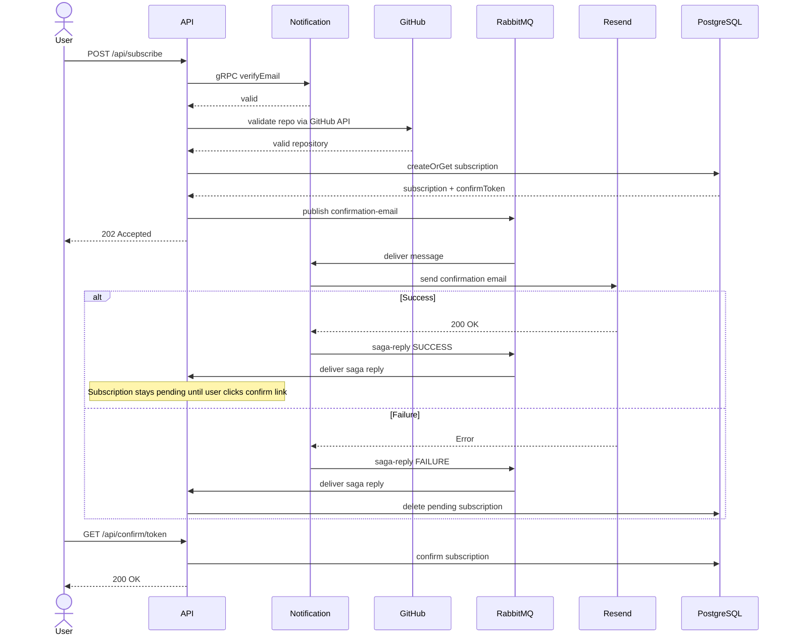
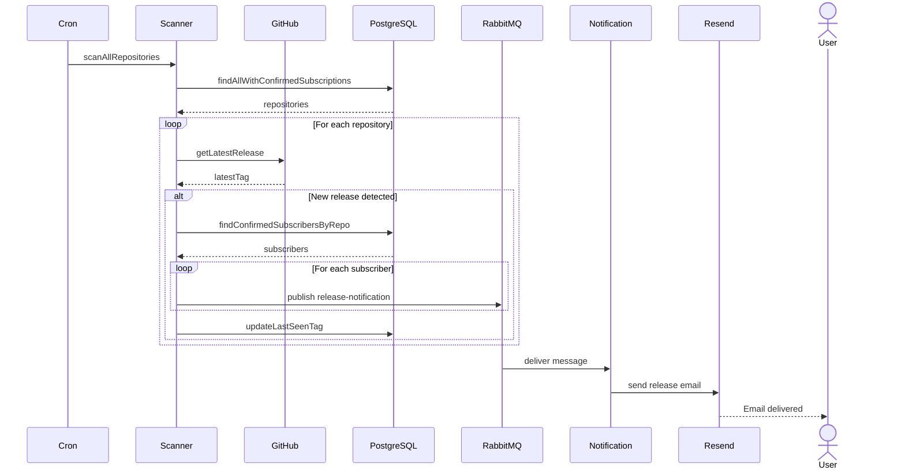
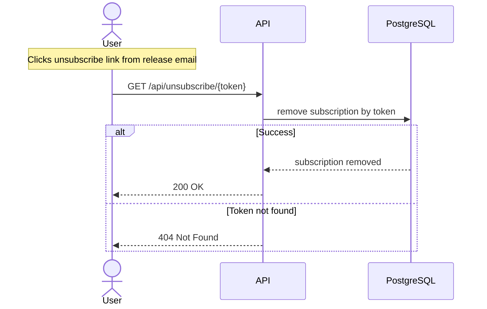

# System Design: GitHub Release Notification API

## 1. Вимоги системи

### Функціональні вимоги

- Користувачі можуть підписатися на оновлення конкретного репозиторію на GitHub
- Для підписки користувач повинен підтвердити свій email (через лист із посиланням на підтвердження)
- Система періодично сканує GitHub на наявність нових релізів
- При знаходженні нового релізу система розсилає email-сповіщення всім підписникам цього репозиторію
- Користувачі можуть відписатися за допомогою посилання в кожному листі

### Нефункціональні вимоги

- **Доступність:** 99.9% uptime для публічного API підписок
- **Затримка:** < 300ms для відповідей REST API
- **Надійність:** Гарантована відправка листів без втрат (retries x3)

### Обмеження

- **GitHub API Rate Limits:** До 5000 запитів на годину
- **Resend Rate Limits:** До 3000 листів на місяць
- **Budget:** Мінімальна інфраструктура

## 2. High-Level архітектура

## 3. Детальний дизайн компонентів

### 3.1 API Service (Node.js/Express)

**Відповідальність:** приймає користувацькі запити, керує підписками та зберігає їх у базі даних.

**Основні функції сервісу:**

- Обробка запитів на підписку, підтвердження та відписку
- Перевірка email через Notification Service (gRPC `verifyEmail`)
- Валідація репозиторію через GitHub API
- Генерація токенів підтвердження email та відписки
- Запис даних у БД (Prisma ORM)
- Публікація подій у RabbitMQ та обробка Saga-відповідей

**Ключові Endpoints:**

- `POST /api/subscriptions` – створення нової підписки
- `GET /api/subscriptions/confirm/:token` – підтвердження імейлу
- `GET /api/subscriptions/unsubscribe/:token` – відписка від сповіщень

### 3.2 Scanner Service

**Відповідальність:** перевіряє GitHub-репозиторії на наявність нових релізів і створює задачі для розсилки сповіщень.

**Основні функції сервісу:**

- Використовує періодичне планування (`croner`)
- Проходиться по всіх унікальних репозиторіях з підтвердженими підписками у базі
- Для кожного робить HTTP запит до `https://api.github.com/repos/{owner}/{repo}/releases/latest`
- Порівнює отриманий тег із збереженим `last_seen_tag`
- Якщо є новий реліз:
  1. Знаходить всіх підтверджених користувачів для цього репозиторію
  2. Публікує повідомлення `release-notification` у RabbitMQ
  3. Оновлює `last_seen_tag` у базі

### 3.3 Notification Service

**Відповідальність:** виконує перевірку email через gRPC, обробляє email-повідомлення з RabbitMQ та відправляє листи користувачам.

**Основні функції сервісу:**

- Надає gRPC endpoint `verifyEmail` для перевірки одноразових email-доменів та синтаксису
- Слухає RabbitMQ черги для подій `confirmation-email` та `release-notification`
- Формує HTML-тіло листа
- Викликає Resend API для фактичної відправки листа користувачу
- Відправляє `saga-reply` у RabbitMQ для координації статусу підписки з API Service

### 3.4 Database (PostgreSQL + Prisma)

**Схема даних:**

**Обмеження цілісності:**

- `Subscriber.email` є унікальним, щоб один email відповідав одному підписнику.
- Пара `Repository.owner + Repository.name` є унікальною, щоб не дублювати один і той самий репозиторій.
- Пара `Subscription.subscriberId + Subscription.repositoryId` є унікальною, щоб користувач не міг мати дубльовану підписку на той самий репозиторій.
- `confirmToken` та `unsubscribeToken` є унікальними, оскільки використовуються для підтвердження підписки та відписки.
- При видаленні підписника або репозиторію пов’язані підписки видаляються каскадно.

## 4. Key Flows

### 4.1 Subscription Flow

### 4.2 Release Scan & Notification Flow

### 4.3 Unsubscribe Flow

