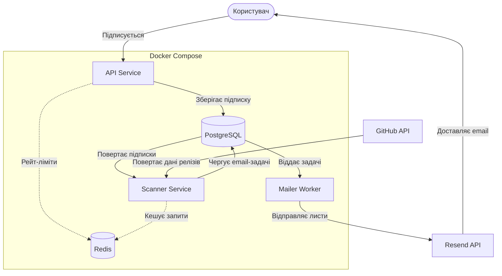

# System Design: GitHub Release Notification API

## 1. Вимоги системи

### Функціональні вимоги

- Користувачі можуть підписатися на оновлення конкретного репозиторію на GitHub
- Для підписки користувач повинен підтвердити свій email (через лист із посиланням на підтвердження)
- Система періодично сканує GitHub на наявність нових релізів
- При знаходженні нового релізу система розсилає email-сповіщення всім підписникам цього репозиторію
- Користувачі можуть відписатися за допомогою посилання в кожному листі

### Нефункціональні вимоги

- **Доступність:** 99.9% uptime для публічного API підписок
- **Затримка:** < 300ms для відповідей REST API
- **Надійність:** Гарантована відправка листів без втрат (retries x3)

### Обмеження

- **GitHub API Rate Limits:** До 5000 запитів на годину
- **Resend Rate Limits:** До 3000 листів на місяць
- **Budget:** Мінімальна інфраструктура

## 2. High-Level архітектура



## 3. Детальний дизайн компонентів

### 3.1 API Service (Node.js/Express)

**Відповідальність:** приймає користувацькі запити, керує підписками та зберігає їх у базі даних.

**Основні функції сервісу:**

- Обробка запитів на підписку
- Генерація токенів для підтвердження email та відписки
- Запис даних користувачів у БД (Prisma ORM)

**Ключові Endpoints:**

- `POST /api/subscriptions` – створення нової підписки
- `GET /api/subscriptions/confirm/:token` – підтвердження імейлу
- `GET /api/subscriptions/unsubscribe/:token` – відписка від сповіщень

### 3.2 Scanner Service

**Відповідальність:** перевіряє GitHub-репозиторії на наявність нових релізів і створює задачі для розсилки сповіщень.

**Основні функції сервісу:**

- Використовує вбудований cron у `pg-boss`
- Проходиться по всіх унікальних репозиторіях у базі
- Для кожного робить HTTP запит до `https://api.github.com/repos/{owner}/{repo}/releases/latest`
- Порівнює отриманий тег із збереженим `last_seen_tag`
- Якщо є новий реліз:
  1. Оновлює `last_seen_tag` у базі
  2. Знаходить всіх підтверджених користувачів для цього репозиторію
  3. Кладе задачі на відправку (job `release-email`) у чергу `pg-boss`

### 3.3 Mailer Worker

**Відповідальність:** обробляє email-задачі з черги та відправляє листи користувачам.

**Основні функції сервісу:**

- Слухає чергу `pg-boss`
- Бере з черги задачі типів `confirmation-email` та `release-email`
- Формує HTML-тіло листа
- Викликає Resend API для фактичної відправки листа користувачу
- У разі збою відправки (наприклад, Resend недоступний), `pg-boss` автоматично зробить retry через певний час (retryLimit: 3)

### 3.4 Database (PostgreSQL + Prisma)

**Схема даних:**

```mermaid
erDiagram
    Repository {
        String id PK
        String owner
        String name
        String lastSeenTag
    }
    Subscriber {
        String id PK
        String email UNIQUE
    }
    Subscription {
        String id PK
        String repositoryId FK
        String subscriberId FK
        Boolean isConfirmed
        String confirmToken UNIQUE
        String unsubscribeToken UNIQUE
    }

    Repository ||--o{ Subscription : "has"
    Subscriber ||--o{ Subscription : "has"
```

**Обмеження цілісності:**

- `Subscriber.email` є унікальним, щоб один email відповідав одному підписнику.
- Пара `Repository.owner + Repository.name` є унікальною, щоб не дублювати один і той самий репозиторій.
- Пара `Subscription.subscriberId + Subscription.repositoryId` є унікальною, щоб користувач не міг мати дубльовану підписку на той самий репозиторій.
- `confirmToken` та `unsubscribeToken` є унікальними, оскільки використовуються для підтвердження підписки та відписки.
- При видаленні підписника або репозиторію пов’язані підписки видаляються каскадно.
